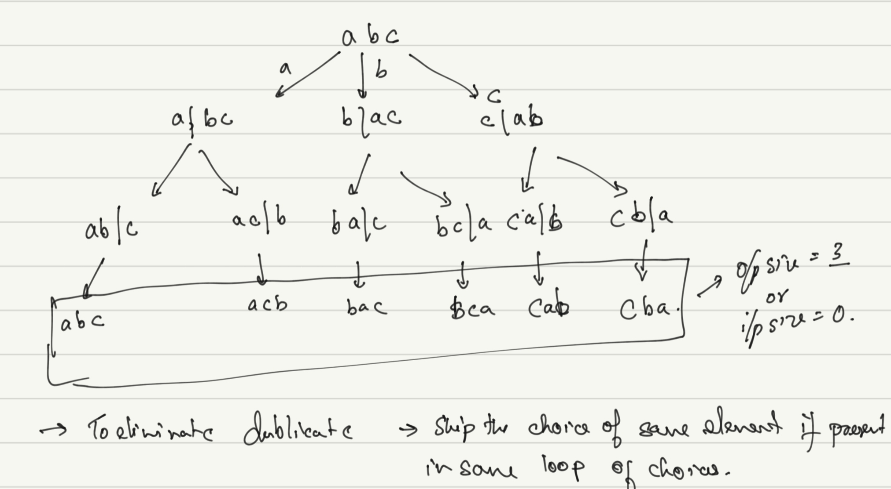
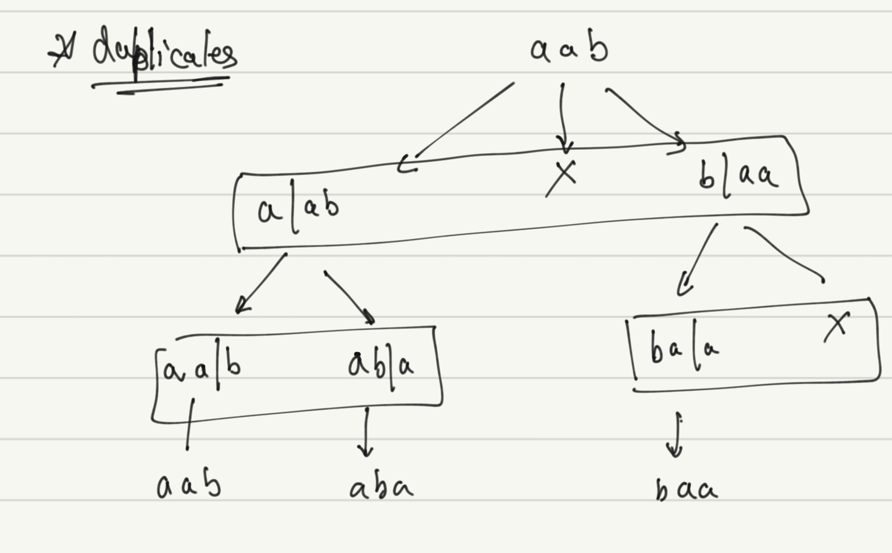
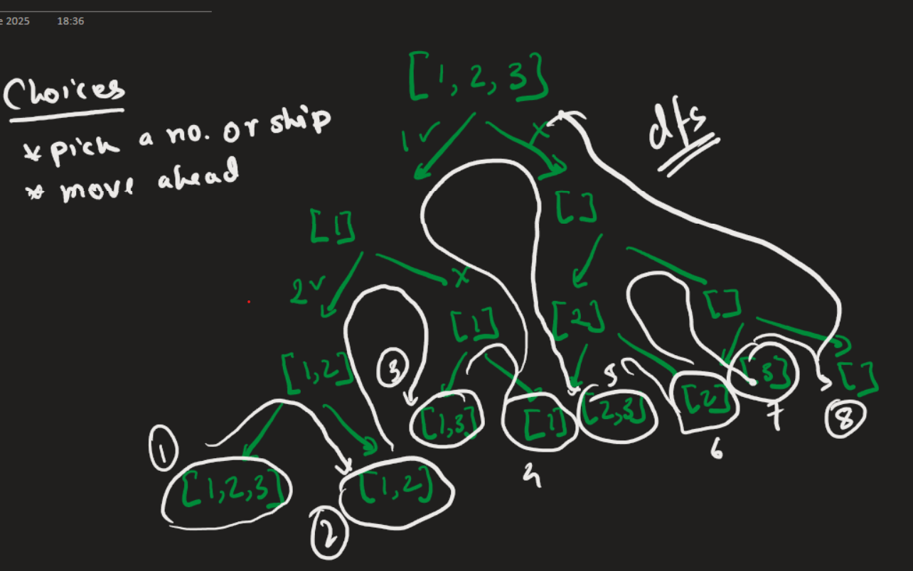

# Backtracking Problems

### Problems
1. [Permutations of a String](#permutations-of-a-string)
1. [Largest number in K swaps](#largest-number-in-k-swaps)
1. [N Digit numbers with digits in increasing order](#n-digit-numbers-with-digits-in-increasing-order)
1. [Subsets](#subsets)
1. [Subsets II](#subsets-ii)
1. [Palindrome Partitioning](#palindrome-partitioning)
1. [Letter Combinations of a Phone Number](#letter-combinations-of-a-phone-number)
1. [Combination Sum](#combination-sum)
1. [Combination Sum II](#combination-sum-ii)
1. [Word Search](#word-search)
1. [Restore IP Addresses](#restore-ip-addresses)

Identification :
    
* chocies + decision.
* all combinations.
* controlled recursion.
> We stop when we know destition wont result the ans
* number of choices.
* size of constraints.
* don't be greedy.

BT = Controllered Recursion + Pass by Reference

```bash
Recursion:  * Choices and Decions
|           * Ans at leaf nodes
|
├── DP      * Optimal solution ask
│           * Ans at root note
│            
├── BT      * Controllered Recursion 
│           * Path by reference
│           * Path gives the nas
```

### Permutations of a String
> Given a string s, which may contain duplicate characters, your task is to generate and return an array of all unique permutations of the string. You can return your answer in any order.

```bash
Examples:

Input: s = "ABC"
Output: ["ABC", "ACB", "BAC", "BCA", "CAB", "CBA"]
Explanation: Given string ABC has 6 unique permutations.
Input: s = "ABSG"
Output: ["ABGS", "ABSG", "AGBS", "AGSB", "ASBG", "ASGB", "BAGS", "BASG", "BGAS", "BGSA", "BSAG", "BSGA", "GABS", "GASB", "GBAS", "GBSA", "GSAB", "GSBA", "SABG", "SAGB", "SBAG", "SBGA", "SGAB", "SGBA"]
Explanation: Given string ABSG has 24 unique permutations.
Input: s = "AAA"
Output: ["AAA"]
Explanation: No other unique permutations can be formed as all the characters are same.
```

Observation

* To make it unique don't include the character if already decided in same choice loop




```cpp
class Solution {
  public:
    vector<string> findPermutation(string &s) {
        // Code here there
        
        vector<string> res;
        string op = "";
        
        permute(s, op, res);
        
        return res;
    }
    
    void permute(string ip, string op, vector<string> &res) {
        if (ip.length() == 0) {
            res.push_back(op);
            return;
        }
        
        unordered_map<char, bool> mp;
        
        // choice loop
        for (int i = 0; i < ip.length(); i++) {
            
            if (mp.find(ip[i]) == mp.end()) {
                mp[ip[i]] = true;
                string _op = op + ip[i];
                string _ip = ip.substr(0, i) + ip.substr(i+1);
                permute(_ip, _op, res);
            }
        }
    }
};

```

### Largest number in K swaps
> Given a number k and string s of digits denoting a positive integer, build the largest number possible by performing swap operations on the digits of s at most k times.

```bash
Examples :

Input: s = "1234567", k = 4
Output: 7654321
Explanation: Three swaps can make the input 1234567 to 7654321, swapping 1 with 7, 2 with 6 and finally 3 with 5.
Input: s = "3435335", k = 3
Output: 5543333
Explanation: Three swaps can make the input 3435335 to 5543333, swapping 3 with 5, 4 with 5 and finally 3 with 4.
Input: s = "1034", k = 2
Output: 4301
Explanation: Two swaps can make the input 1034 to 4301, swapping 1 with 4 and finally 0 with 3. 
Constraints:
1 ≤ s.size() ≤ 15
1 ≤ k ≤ 7
```

Observation:
* If we search the max no and swap to first/second ... location.
* greedy apporach : will it work ?
* 4 5 7 7 ; k = 2; greedy 7 7 4 5
* but optimal is 7 7 5 4

* what are the choices ? 
- no swap with self; we will waste k 
- no swap with smaller elements; same reason
- swap with the largest in the array ? isn't greedy?
- No next subtree will follow the same logic

```cpp
class Solution {
  public:
  void Solve(int idx, string str, int k, string& ans){
      if( k==0 || idx >= str.size())
            return;
      
      // find the max num that can be replaced
      char maxC = str[idx];
      for(int i = idx + 1 ; i<str.size(); i++){
        if(str[i] > maxC)
            maxC = str[i];
      }
      
      if (str[idx] == maxC)
        return Solve(idx + 1, str, k, ans);
      
     // choice loop
      for(int i = idx + 1; i < str.size(); i++){
            
          // only swap with potential high element
          if(str[idx] < str[i] && maxC == str[i]) {
    
            
            swap(str[idx], str[i]);
            // swap and compare with the already present ans
            if(str.compare(ans) > 0)
                ans = str;
            // jmp to next location
            Solve(idx + 1, str, k - 1, ans);
            // since we are using the same string
            // if we jmp to next brach we need to have original string
            swap(str[idx], str[i]);
          }
      }
  }
    // Function to find the largest number after k swaps.
    string findMaximumNum(string& s, int k) {
        string ans = s;
        Solve(0, s, k, ans);
        
        return ans;
    }
};
```
### N Digit numbers with digits in increasing order
> Given an integer n, print all the n digit numbers in increasing order, such that their digits are in strictly increasing order(from left to right).

```bash
Example 1:

Input:
n = 1
Output:
0 1 2 3 4 5 6 7 8 9
Explanation:
Single digit numbers are considered to be 
strictly increasing order.
Example 2:

Input:
n = 2
Output:
12 13 14 15 16 17 18 19 23 24....79 89
Explanation:
For n = 2, the correct sequence is
12 13 14 15 16 17 18 19 23 and so on 
up to 89. 

20 21 not allowed
30 31 32 not allowed
40 41 42 43 not allowed
```

```cpp
// User function Template for C++
class Solution {
  public:
    vector<int> increasingNumbers(int n) {
        // Write Your Code here
        vector<int> res;

        // Handle n == 1 case separately
        if (n == 1) {
            for (int i= 0; i < 10; i++) {
                res.push_back(i);
            }
            
            return res;
        }
        
        solve(0, "", n, res);
        
        return res;
    }
    
    void solve(int last_digit, string out, int n, vector<int> &res) {
        //base
        if (n == 0) {
            res.push_back(stoi(out));
            return;
        }
            
        for (int i = last_digit + 1; i <= 9; i++) {
            string str =  out + to_string(i);
            
            solve(i, str, n - 1, res);
        }
    }
};
```

### Subsets
> Given an integer array nums of unique elements, return all possible subsets (the power set).
> The solution set must not contain duplicate subsets. Return the solution in any order.
```bash
Example 1:

Input: nums = [1,2,3]
Output: [[],[1],[2],[1,2],[3],[1,3],[2,3],[1,2,3]]
Example 2:

Input: nums = [0]
Output: [[],[0]]
```
* Choices : either include s[i] or exclude and move to next num
* While returning save the subsets.



```cpp
class Solution {
    vector<int> subs;
    vector<vector<int>> res;
public:
    vector<vector<int>> subsets(vector<int>& nums) {
        
        res.clear();
        subs.clear();

        dfs(0, nums);

        return res;
    }

    void dfs(int i, vector<int>& nums) {

        if (i >= nums.size()) {
            res.push_back(subs);
            return;
        }

        subs.push_back(nums[i]);
        dfs(i + 1, nums);
        subs.pop_back();
        dfs(i + 1, nums);
    }
};
```
### Subsets II
> Given an integer array nums that may contain duplicates, return all possible subsets (the power set).
The solution set must not contain duplicate subsets. Return the solution in any order.

```bash
Example 1:

Input: nums = [1,2,2]
Output: [[],[1],[1,2],[1,2,2],[2],[2,2]]
Example 2:

Input: nums = [0]
Output: [[],[0]]
```

* Sort the array first, then skip the duplicated after traversing 

```cpp
class Solution {
    vector<vector<int>> res;
    vector<int> subs;
public:
    vector<vector<int>> subsetsWithDup(vector<int>& nums) {
        sort(nums.begin(), nums.end());
        res.clear();
        subs.clear();

        dfs(0, nums);

        return res;
    }

    void dfs(int i, vector<int>& nums) {

        if (i >= nums.size()) {
            res.push_back(subs);
            return;
        }

        subs.push_back(nums[i]);
        dfs(i + 1, nums);
        subs.pop_back();

        while (i + 1 < nums.size() && nums[i] == nums[i + 1])
            i++;

        dfs(i + 1, nums);
    }
};
```

### Palindrome Partitioning
> Given a string s, split s into substrings where every substring is a palindrome. Return all possible lists of palindromic substrings.
> You may return the solution in any order.
```bash
Example 1:

Input: s = "aab"

Output: [["a","a","b"],["aa","b"]]
Example 2:

Input: s = "a"

Output: [["a"]]
```
* Why pop > we want to resue one one partition list.
```cpp
class Solution {
public:
    vector<vector<string>> res;
    vector<string> part;
    vector<vector<string>> partition(string s) {
        res.clear();
        part.clear();

        dfs(0, s);

        return res;
    }

    void dfs( int p, string& s) {
        if (p >= s.length()) {
            res.push_back(part);
            return;
        }

        for ( int i = p; i < s.length(); i++) {
            if (isPalim(s, p, i)) {
                part.push_back(s.substr(p, i - p + 1));
                dfs(i + 1, s);
                part.pop_back();
            }
        }
    }

    bool isPalim(string& str, int s, int l) {
        while (s <= l) {
            if (str[s] != str[l])
                return false;
            s++;
            l--;
        }

        return true;
    }
};

```
### Letter Combinations of a Phone Number
```bash
Example 1:

Input: digits = "34"

Output: ["dg","dh","di","eg","eh","ei","fg","fh","fi"]
Example 2:

Input: digits = ""

Output: []
```

```cpp
class Solution {
public:
    vector<string> res;
    vector<string> digitToChar = {"", "", "abc", "def", "ghi", "jkl", 
                                  "mno", "qprs", "tuv", "wxyz"};
    vector<string> letterCombinations(string digits) {
        res.clear();
        if (digits == "")
            return res;

        dfs(0, "", digits);

        return res;
    }

    void dfs(int s, string str, string& digits) {
        if (s >= digits.length()) {
            res.push_back(str);
            return;
        }

        for (auto c: digitToChar[digits[s] - '0']) {
            dfs(s + 1, str + c, digits);
        }

    }
};

```
### Combination Sum
> You are given an array of distinct integers nums and a target integer target. Your task is to return a list of all unique combinations of nums where the chosen numbers sum to target.
> The same number may be chosen from nums an unlimited number of times. Two combinations are the same if the frequency of each of the chosen numbers is the same, otherwise they are different.
> You may return the combinations in any order and the order of the numbers in each combination can be in any order.
```bash
Example 1:

Input: 
nums = [2,5,6,9] 
target = 9

Output: [[2,2,5],[9]]
Explanation:
2 + 2 + 5 = 9. We use 2 twice, and 5 once.
9 = 9. We use 9 once.

Example 2:

Input: 
nums = [3,4,5]
target = 16

Output: [[3,3,3,3,4],[3,3,5,5],[4,4,4,4],[3,4,4,5]]
Example 3:

Input: 
nums = [3]
target = 5

Output: []
```

```cpp
class Solution {
public:
    vector<vector<int>> res;
    vector<int> comb;
    vector<vector<int>> combinationSum(vector<int>& nums, int target) {
        res.clear();
        comb.clear();

        dfs(0, target, nums);
        return res;
    }

    void dfs(int s, int target, vector<int>& nums) {

        if (target  == 0) {
            res.push_back(comb);
            return;
        }

        for (int i = s; i < nums.size(); i++) {
            if (nums[i] <= target) {
                comb.push_back(nums[i]);
                dfs(i, target - nums[i], nums);
                comb.pop_back();
            }
        }
    }
};

```
### Combination Sum II

> You are given an array of integers candidates, which may contain duplicates, and a target integer target. Your task is to return a list of all unique combinations of candidates where the chosen numbers sum to target.
> Each element from candidates may be chosen at most once within a combination. The solution set must not contain duplicate combinations.
> You may return the combinations in any order and the order of the numbers in each combination can be in any order.

```bash
Example 1:

Input: candidates = [9,2,2,4,6,1,5], target = 8

Output: [
  [1,2,5],
  [2,2,4],
  [2,6]
]
Example 2:

Input: candidates = [1,2,3,4,5], target = 7

Output: [
  [1,2,4],
  [2,5],
  [3,4]
]
```

```cpp
class Solution {
public:
    vector<vector<int>> res;
    vector<int> comb;
    vector<vector<int>> combinationSum2(vector<int>& nums, int target) {
        res.clear();
        comb.clear();
        sort(nums.begin(), nums.end());

        dfs(0, target, nums);
        return res;
    }

    void dfs(int s, int target, vector<int>& nums) {

        if (target == 0) {
            res.push_back(comb);
            return;
        }
        for (int i = s; i < nums.size(); i++) {
            if ( i > s && nums[i] == nums[i -1])
                continue;
            if (nums[i] <= target) {
                comb.push_back(nums[i]);
                dfs(i + 1, target - nums[i], nums);
                comb.pop_back();
            }
        }
    }
};
```
### Word Search
> Given a 2-D grid of characters board and a string word, return true if the word is present in the grid, otherwise return false.
> For the word to be present it must be possible to form it with a path in the board with horizontally or vertically neighboring cells. The same cell may not be used more than once in a word.

```bash
Example 1:

Input: 
board = [
  ["A","B","C","D"],
  ["S","A","A","T"],
  ["A","C","A","E"]
],
word = "CAT"

Output: true
Example 2:


Input: 
board = [
  ["A","B","C","D"],
  ["S","A","A","T"],
  ["A","C","A","E"]
],
word = "BAT"

Output: false
```

* dont visit the node already visited, that why changed the char to '#'

```cpp
class Solution {
public:
    int rCount;
    int cCount;
    vector<vector<char>> board;
    string word;

    bool exist(vector<vector<char>>& board, string word) {
        this->board = board;
        rCount = board.size();
        cCount = board[0].size();
        this->word = word;

        for (int i = 0; i < rCount; i++) {
            for (int j = 0; j < cCount; j++) {
               if (dfs(i, j, 0))
                    return true;
            }
        }
        return false;
    }

    bool dfs(int r, int c, int i) {

        if (i == word.size())
            return true;

        if (r < 0 || c < 0 || r >= rCount || c >= cCount ||
            board[r][c] != word[i] || board[r][c] == '#')
            return false;

        board[r][c] = '#';

        bool res = dfs(r - 1, c, i + 1 ) ||
        dfs(r + 1, c, i + 1 ) ||
        dfs(r , c - 1, i + 1 ) ||
        dfs(r, c + 1, i + 1 );
        
        board[r][c] = word[i];

        return res;
    }
};

```

### Restore IP Addresses
> A valid IP address consists of exactly four integers separated by single dots. Each integer is between 0 and 255 (inclusive) and cannot have leading zeros.

For example, "0.1.2.201" and "192.168.1.1" are valid IP addresses, but "0.011.255.245", "192.168.1.312" and "192.168@1.1" are invalid IP addresses.
Given a string s containing only digits, return all possible valid IP addresses that can be formed by inserting dots into s. You are not allowed to reorder or remove any digits in s. You may return the valid IP addresses in any order.


```bash
Example 1:

Input: s = "25525511135"
Output: ["255.255.11.135","255.255.111.35"]
Example 2:

Input: s = "0000"
Output: ["0.0.0.0"]
Example 3:

Input: s = "101023"
Output: ["1.0.10.23","1.0.102.3","10.1.0.23","10.10.2.3","101.0.2.3"]
```


```cpp
class Solution {
public:
    vector<string> res;
    vector<string> restoreIpAddresses(string s) {
        bk(0, {}, s);
        return res;
    }

    void bk(int start, vector<string> part, string& s) {
        // Base Case: If we have 4 segments
        if (part.size() == 4) {
            // If we've also reached the end of the string, it's valid
            if (start == s.length()) {
                res.push_back(part[0] + "." + part[1] + "." + part[2] + "." + part[3]);
            }
            return;
        }

        // check segments 1 to 3
        for (int i = 1; i < 4; i++) {
            if (start + i > s.length())
                break;
            
            if (i > 1 && s[start] == '0')
                continue;
            
            string seg = s.substr(start, i);
            int val = stoi(seg);
            if ( val >= 0 && val <= 255) {
                part.push_back(seg);
                bk(start + i, part, s);
                part.pop_back();
            }

        }
    }
};
```